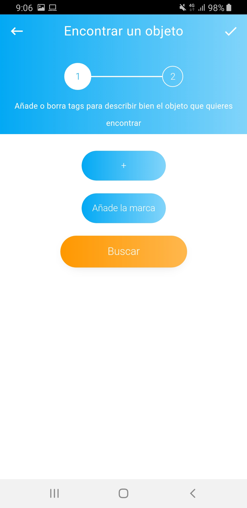

<h1>Lost&Found (Proyecto Awug 3)</h1> 
<h2>Grupo 7</h2>
<b>Group Members</b>
<ul>
<li>Alexandra Barron (Design) </li>
<li>Eva Barbero (Design) </li>
<li>Laura Gonzalez (UX)</li>
<li>Pau Enrech (Programming)</li>
</ul>

<h1>Apis</h1>
<ul>
<li>Barcelona Open Data</li>
<li>API: https://cloud.google.com/vision/?hl=es</li>
</ul>
<h1>Technology</h1
<ul>
  <li> Cordova: https://cordova.apache.org/ </li>
  <li> NPM : https://www.npmjs.com/ </li>
  <li> Vue: https://vuejs.org/ </li>
  <li> Vue Material: https://vuematerial.io/ </li>
  <li> Jquery: https://jquery.com/ </li>
  <li> Firebase: https://firebase.google.com/?hl=es-419 </li>
</ul>
<h1>Description</h1>

Academic project consist on develop an hybrid application that could be used on a real situation

If someone lose their belongings at Barcelona's underground, rail train, bus, or trolley car and is found, then is carried to the station manager. Then a lost report is done, but It could take up to 24h to get registered in the system. Furthermore, if something is found on the street its usually carried to a police station where It also has to be reported, with its usual delays

Due to this, the person who loses something may call lost objects of the City of Barcelona and not know until much later if the object has been found or not.

The application implements an interface that allows the official to take a photo of the object found and through the Google API a list of tags are auto generated, then the official chooses which of these tags include and whether or not to add new tags. Something important may be the insertion of the brand of the object as a relevant tag and also the the place where it was found. This place will be in a drop-down that will be filled with data from the Barcelona Open Data databases.

In addition, the official can add relevant info of the object found as if they were Tag, similar to the hashtag in Instagram.
The user can search by tags. A list of images related to this tags will be shown. Each of them will show additional information of where have been found and a contact telephone number.

<h1>Screenshots</h1>

  
  
  

  
  
  

  
  
  

<h1>Demo *</h1>

*A higher quality and longer video opens on YouTube when clicked

<h3>Admin user</h3>

  
  

 

  
  

 

  
  

 
<h3>User</h3>

  
  

 

  
  

 

  
  

